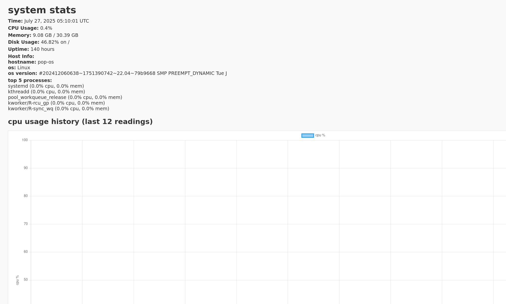

# System Monitor Dashboard

a simple system‑monitoring dashboard that:

- collects cpu, memory, disk, network, uptime, host info, and top processes
- writes current metrics to `public/stats.json`
- keeps a rolling history of the last 12 cpu readings in `public/history.json`
- displays data in a web dashboard with Chart.js
- provides a "refresh now" button and auto‑refresh every minute
- updates every 5 minutes via cron, with logging to `monitor.log`

## features

- python script (`monitor.py`) using psutil
- cron automation (every 5 minutes) via `crontab.txt`
- static site frontend (`public/`) with vanilla js and Chart.js
- manual refresh button plus auto‑refresh logic
- rolling history chart of cpu usage (last 12 readings)
- robust error and activity logging (`monitor.log`, `cron.log`, `heartbeat.log`)
- sample log files (`*.sample.log`) and sample json files (`*.sample.json`) to show format

## prerequisites

- python 3.7 or higher
- psutil (install via `pip install psutil`)
- bash shell with cron
- a modern web browser

## installation & usage

```bash
# 1. clone the repository
git clone https://github.com/youruser/sysmonitor.git
cd sysmonitor

# 2. install dependencies
pip install psutil

# 3. prepare the public folder
mkdir -p public

# 4. run the script manually (verify it works)
python3 monitor.py
head -n 20 public/stats.json
head -n  5 public/history.json

# 5. serve the dashboard
cd public
python3 -m http.server 8000
# open http://localhost:8000 in your browser

# 6. install the cron job (automate every 5 minutes)
crontab crontab.txt
crontab -l
tail -f monitor.log cron.log heartbeat.log

# 7. view sample logs and json
head -n 5 monitor.sample.log
head -n 5 heartbeat.sample.log
head -n 5 stats.sample.json
head -n 5 history.sample.json
```

## Demo

here’s how the dashboard looks:


